NoSQL Workshop - Mongo Crud Operations

## Sections:

* [CRUD Operations](#crud-operations)
* [Insert Documents](#insert_documents)
* [Query Documents](#query_documents)
* [Update Documents](#update_documents)
* [Delete Documents](#delete_documents)
* [Bread Crumb Navigation](#bread-crumb-navigation)

*All of this information is gathered from the official mongodb docs in https://docs.mongodb.com/manual/crud/*

### CRUD operations

* CRUD ==> Create, Read, Update, and Delete Documents.

Create or insert operations add new documents to a collection. 

If the collection does not currently exist, insert operations will create the collection.

MongoDB provides the following methods to insert documents into a collection:

* [db.collection.insertOne()](https://docs.mongodb.com/manual/reference/method/db.collection.insertOne/#db.collection.insertOne)

* [db.collection.insertMany()](https://docs.mongodb.com/manual/reference/method/db.collection.insertMany/#db.collection.insertMany)

In MongoDB, insert operations target a single collection. 

*All write operations in MongoDB are atomic on the level of a single document.*

```bash
db.people.insertOne( // collection
    {                        // document
        name: "John Rambo",  // field: value
        age: 34,             // field: value
        status: "MIA"        // field: value
    }
)
```

#### Read Operations

Read operations retrieves documents from a collection; i.e. queries a collection for documents. 

MongoDB provides the following methods to read documents from a collection:

* [db.collection.find()](https://docs.mongodb.com/manual/reference/method/db.collection.find/#db.collection.find)

Let us look at an example in the mongo shell:


*Notice that in the example above we use projection and only age is returned back while the _id is always returned in MongoDB.*

#### Update Operations

Update operations modify existing documents in a collection. MongoDB provides the following methods to update documents of a collection:

* [db.collection.updateOne()](https://docs.mongodb.com/manual/reference/method/db.collection.updateOne/#db.collection.updateOne)

* [db.collection.updateMany()](https://docs.mongodb.com/manual/reference/method/db.collection.updateMany/#db.collection.updateMany)

* [db.collection.replaceOne()](https://docs.mongodb.com/manual/reference/method/db.collection.replaceOne/#db.collection.replaceOne)

Let us look at an example in the mongo shell:


#### Delete Operations

Delete operations remove documents from a collection. MongoDB provides the following methods to delete documents of a collection:

* [db.collection.deleteOne()](https://docs.mongodb.com/manual/reference/method/db.collection.deleteOne/#db.collection.deleteOne)

* [db.collection.deleteMany()](https://docs.mongodb.com/manual/reference/method/db.collection.deleteMany/#db.collection.deleteMany)

In MongoDB, delete operations target a single collection. All write operations in MongoDB are atomic on the level of a single document.

You can specify criteria, or filters, that identify the documents to remove. These filters use the same syntax as read operations.

Let us look at some examples in the mongo shell:


*Notice that deleteMany deleted more than one document.*

#### Bulk Write

*MongoDB provides the ability to perform write operations in bulk.*

###### Insert Documents

[Insert Documents](https://docs.mongodb.com/manual/tutorial/insert-documents/)

*If the collection does not currently exist, insert operations will create the collection.*


`db.collection.insertMany()` can insert multiple documents into a collection. 

Pass an array of documents to the method.


Notice in the screenshot above that we created arrays in the mongo shell and then passed the numbers array into the insertMany collection method.

Also notice that the `insertMany()` method returns a document that includes the newly inserted documents _id field values.

*All write operations in MongoDB are atomic on the level of a single document.*

###### Insert Methods in mongodb

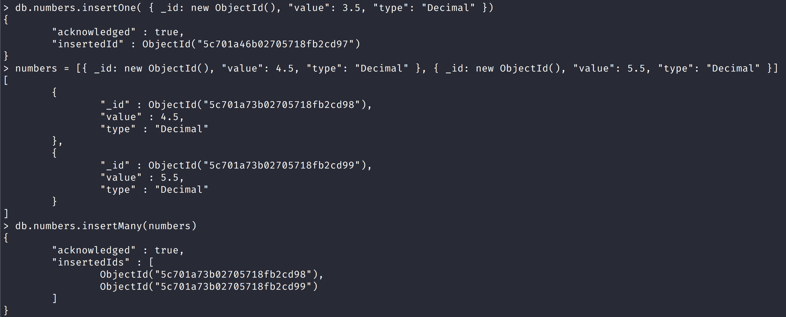

Notice that in this screenshot we use insertOne to insert one document and insertMany to insert an array of documents.


Notice that here we were able to pass an array into the `insert()` method as well like we did in the `insertMany()` method.


Notice that in this screenshot we used an options object with a field of `upsert: true` to create a document that it did not exist already.

You can use the upsert option with the other write methods to create a document as well:

* [db.collection.updateOne()](https://docs.mongodb.com/manual/reference/method/db.collection.updateOne/#db.collection.updateOne)
* [db.collection.updateMany()](https://docs.mongodb.com/manual/reference/method/db.collection.updateMany/#db.collection.updateMany)
* [db.collection.findAndModify()](https://docs.mongodb.com/manual/reference/method/db.collection.findAndModify/#db.collection.findAndModify)
* [db.collection.findOneAndUpdate()](https://docs.mongodb.com/manual/reference/method/db.collection.findOneAndUpdate/#db.collection.findOneAndUpdate)
* [db.collection.findOneAndReplace()](https://docs.mongodb.com/manual/reference/method/db.collection.findOneAndReplace/#db.collection.findOneAndReplace)
* [db.collection.save()](https://docs.mongodb.com/manual/reference/method/db.collection.save/#db.collection.save)
* [db.collection.bulkWrite()](https://docs.mongodb.com/manual/reference/method/db.collection.bulkWrite/#db.collection.bulkWrite)

###### Query Documents

The most common method to query documents in mongodb is the `find()` method.

###### Select All Documents in a Collection

We can select all the documents in the numbers collection with the following query:

```js
db.numbers.find({})
```

This command is the equivalent to the following SQL command: `SELECT * FROM numbers`

###### Specify Equality Condition

You can pass in a query object to specify an equality condition in mongodb.

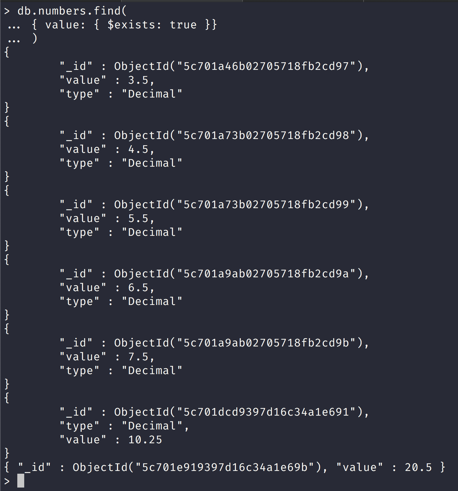

*Notice that we only got back the number documents that match this query.*

###### Specify AND Conditions

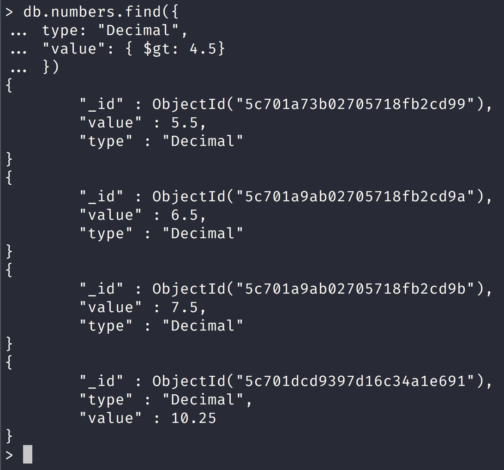

Notice that here we specified an additional condition here and in SQL this would be the equivalent query:

```sql
SELECT * FROM numbers WHERE type = "Decimal" AND value > 4.5
```

###### Specify OR Conditions


Notice that in this query we specified an or condition and in SQL this would be the equivalent query:

```sql
SELECT * FROM numbers WHERE type = "Dont know" OR "val" = 19.8
```

###### Specify AND and OR Conditions

```js
db.inventory.find( {
     status: "A",
     $or: [ { qty: { $lt: 30 } }, { item: /^p/ } ]
} )
```

This query will check the status of A and use the or condition of whether qty is less than 30 or item field starts with p

In SQL this would be the equivalent query:

```sql
SELECT * FROM inventory WHERE status = "A" AND ( qty < 30 OR item LIKE "p%")
```

*MongoDB supports regular expressions $regex queries to perform string pattern matches.*

###### Cursor 

[Cursor](https://docs.mongodb.com/manual/tutorial/query-documents/#cursor)

> The `db.collection.find()` method returns a cursor to the matching documents.

###### Additional Read Methods

`db.collection.findOne` read method:

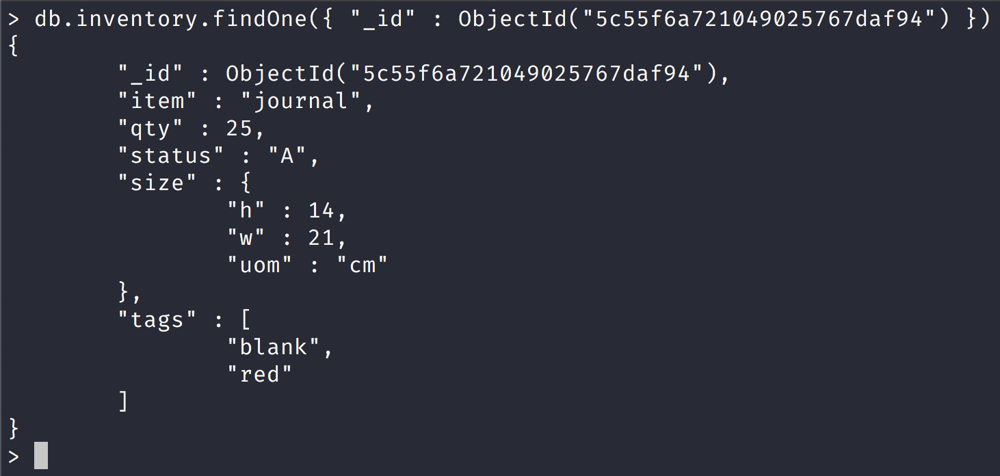

###### Match an Embedded/Nested Document

To specify an equality condition on a field that is an embedded/nested document, use the query filter document 
{ &#60;field&#62;: &#60;value&#62; } where &#60;value&#62; is the document to match.

> Equality matches on the whole embedded document require an exact match of the specified &#60;value&#62; document, including the field order. 

For example, the following query does not match any documents in the inventory collection.

Notice this behavior in the screenshot below:

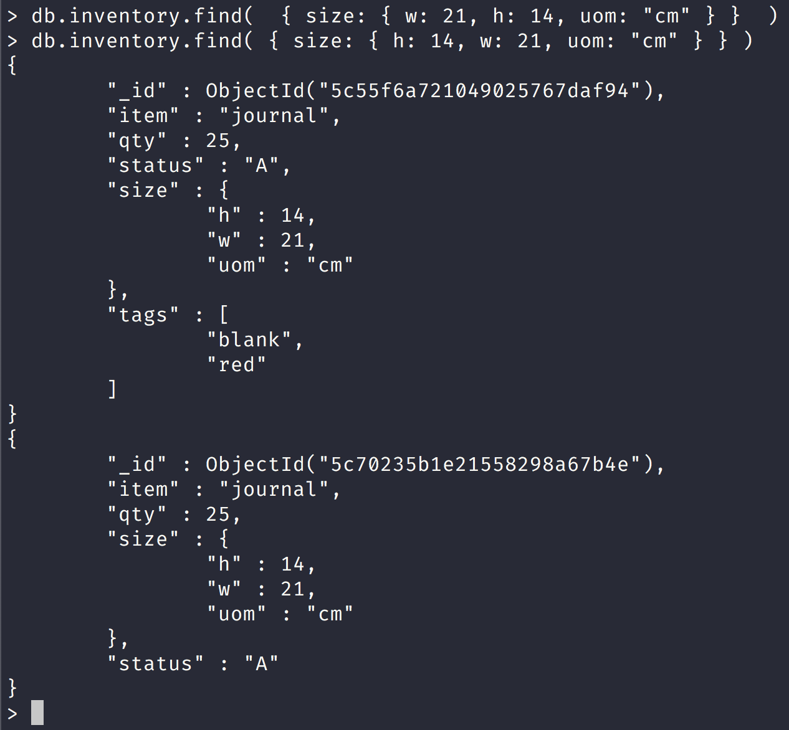

###### Query on Nested Field

You must place nested field queries in double quotes. 

Notice this behavior in the screenshot below:

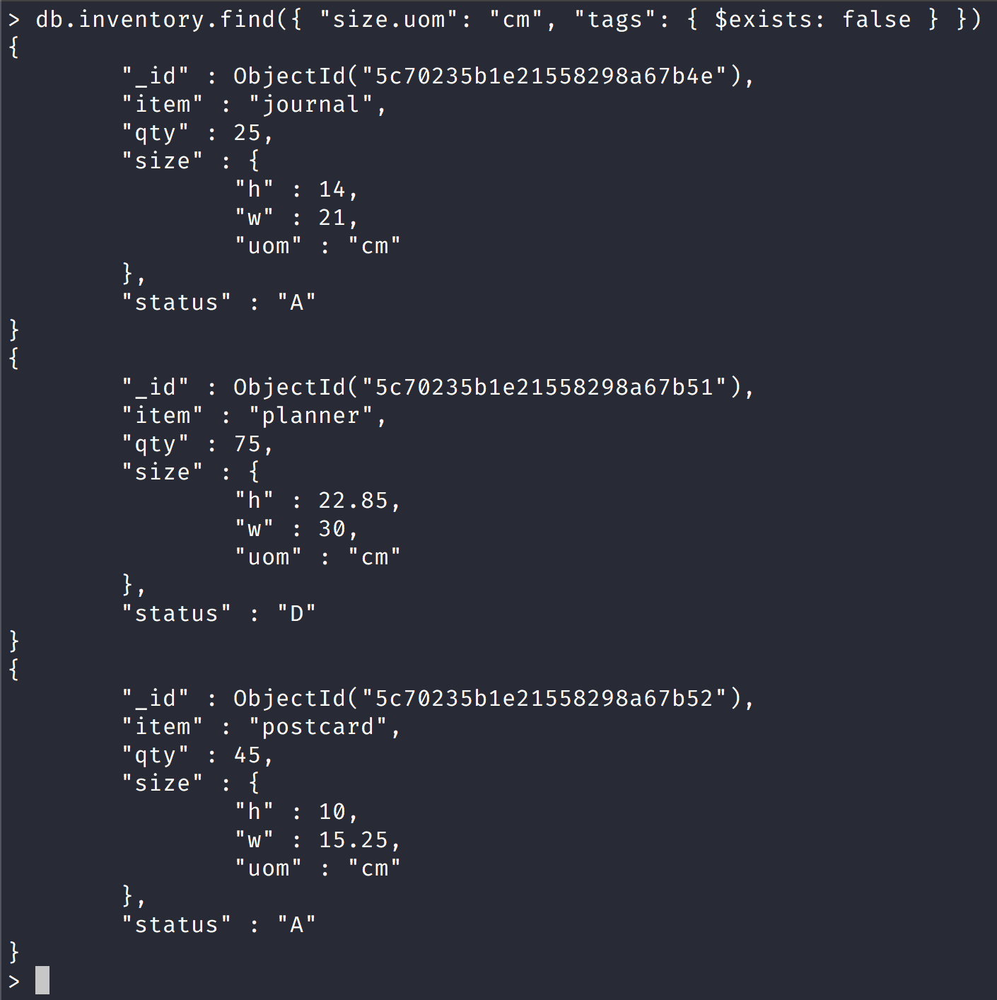

###### Specify Match using Query Operator

A query filter document can use the query operators to specify conditions in the following form:

| Name | Description | 
| --- | --- |
| &#36;eq | Matches values that are equal to a specified value. | 
| &#36;gt | Matches values that are greater than a specified value. | 
| &#36;gte | Matches values that are greater than or equal to a specified value. | 
| &#36;in | Matches any of the values specified in an array. | 
| &#36;lt | Matches values that are less than a specified value. | 
| &#36;lte | Matches values that are less than or equal to a specified value. | 
| &#36;ne | Matches all values that are not equal to a specified value. | 
| &#36;nin | Matches none of the values specified in an array. | 

Look at the screenshot below for an example using `$gt` query operator in action:

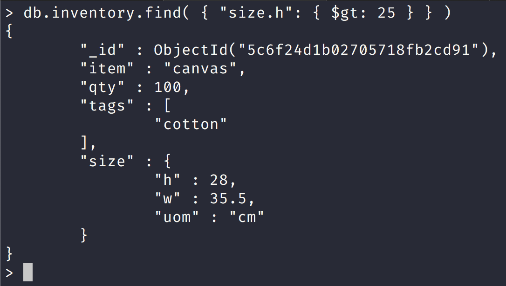

We can even chain query operators with an AND condition as the screenshot below demonstrates:


###### Match an array

[Match Array](https://docs.mongodb.com/manual/tutorial/query-arrays/#match-an-array)

To specify equality condition on an array, use the query document { &#60;field>&#62;: &#60;value&#62; } 
where &#60;value&#62; is the exact array to match, including the order of the elements.

If you don't use the $all query operator then the equality match in the array must match the order and value.
Look at the screenshot below for an illustration:

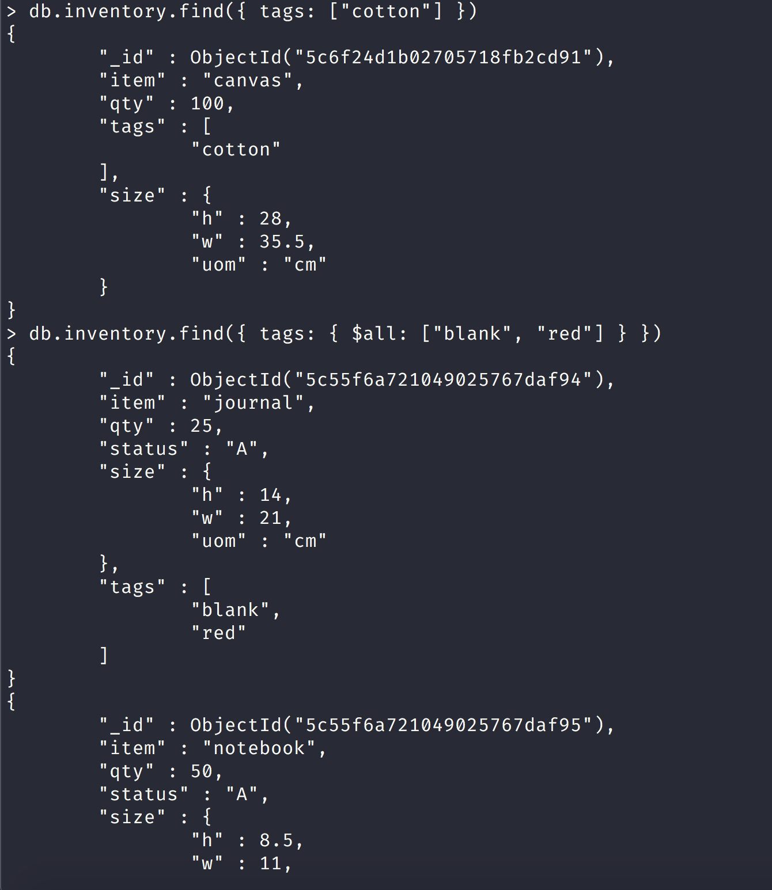

###### Query an array for a particular element

You can query an array for a particular element by doing:

{ &#60;field>&#62;: &#60;value&#62; } 

Look at the screenshot below:

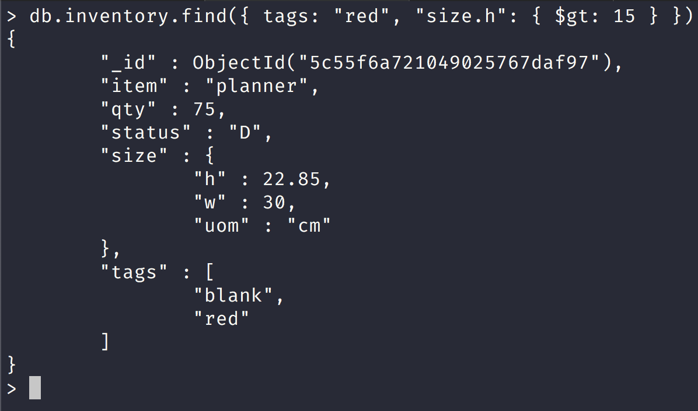

###### Query an Array with Compound Filter Conditions on the Array Elements

> The following example queries for documents where the *dim_cm* array contains elements that in some combination satisfy the query conditions; e.g., one element can satisfy the greater than 15 condition and another element can satisfy the less than 20 condition, or a single element can satisfy both:

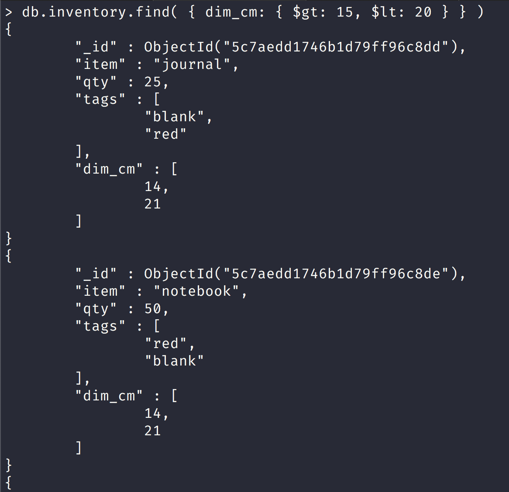

###### Query for an Array Element that Meets Multiple Criteria

> Use `$elemMatch` operator to specify multiple criteria on the elements of an array such that at least one array element satisfies all the specified criteria.

The following example queries for documents where the dim_cm array contains at least one element that is both greater than ($gt) 22 and less than ($lt) 30:

```js
db.inventory.find({ dim_cm: { $elemMatch: { $gt: 22, $lt: 30 } } })
```

###### Query for an Element by the Array Index Position

> Using dot notation, you can specify query conditions for an element at a particular index or position of the array. 
The array uses zero-based indexing.

Look at the screenshot below for an example of this:

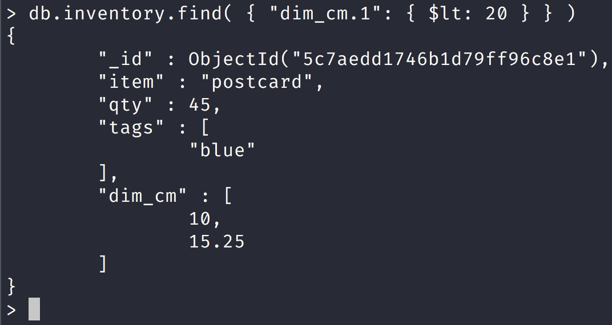

###### Query an Array by Array Length

> Use the $size operator to query for arrays by number of elements. 

For example, the following selects documents where the array tags has 3 elements.

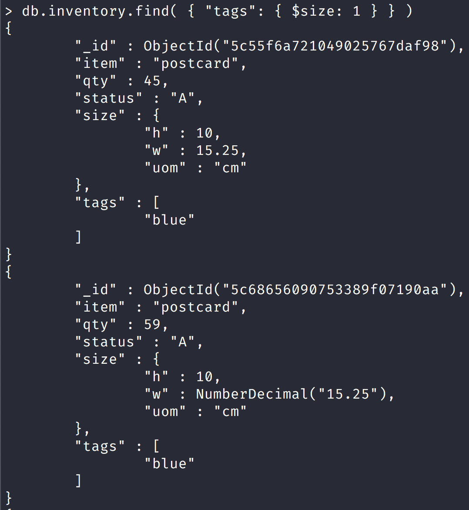

###### Query an Array of Embedded Documents

###### Query for a Document Nested in an Array

> The following example selects all documents where an element in the instock array matches the specified document:


> Equality matches on the whole embedded/nested document require an exact match of the specified document, including the field order. For example, the following query does not match any documents in the inventory collection:

So you can't do something like this:

```js
> db.inventory.find( { "instock": { warehouse: "B", qty: { $gt: 30 } } } )
```

since the nested document that would work has the following structure:

```js
{
	"_id" : ObjectId("5c7af040746b1d79ff96c8e5"),
	"item" : "planner",
	"instock" : [
		{
			"warehouse" : "A",
			"qty" : 40
		},
		{
			"warehouse" : "B",
			"qty" : 5
		}
	]
}
```

*Notice how `instock` has 2 documents where one is greater than 30 but another is less than 30*

###### Specify a Query Condition on a Field in an Array of Documents

> If you do not know the index position of the document nested in the array, concatenate the name of the array field, with a dot (.) and the name of the field in the nested document.

> The following example selects all documents where the instock array has at least one embedded document that contains the field qty whose value is less than or equal to 20:

```js
db.inventory.find( { 'instock.qty': { $lte: 20 } } )
```

###### A Single Nested Document Meets Multiple Query Conditions on Nested Fields

> Use `$elemMatch` operator to specify multiple criteria on an array of embedded documents such that at least one embedded document satisfies all the specified criteria.

> The following example queries for documents where the instock array has at least one embedded document that contains both the field qty equal to 5 and the field warehouse equal to A:

```js
db.inventory.find( { "instock": { $elemMatch: { qty: 5, warehouse: "A" } } } )
```

> The following example queries for documents where the instock array has at least one embedded document that contains the field qty that is greater than 10 and less than or equal to 20:

```js
db.inventory.find( { "instock": { $elemMatch: { qty: { $gt: 10, $lte: 20 } } } } )
```

###### Combination of Elements Satisfies the Criteria

> If the compound query conditions on an array field do not use the $elemMatch operator, the query selects those documents whose array contains any combination of elements that satisfies the conditions.

> For example, the following query matches documents where any document nested in the instock array has the qty field greater than 10 and any document (but not necessarily the same embedded document) in the array has the qty field less than or equal to 20:

```js
db.inventory.find( { "instock.qty": { $gt: 10,  $lte: 20 } } )
```

> The following example queries for documents where the instock array has at least one embedded document that contains the field qty equal to 5 and at least one embedded document (but not necessarily the same embedded document) that contains the field warehouse equal to A:

```js
db.inventory.find( { "instock.qty": 5, "instock.warehouse": "A" } )
```

###### Project Fields to Return from Query

> By default, queries in MongoDB return all fields in matching documents. 

To limit the amount of data that MongoDB sends to applications, you can include a projection document to specify or restrict fields to return.

###### Return All Fields in Matching Documents

*If you do not specify a projection document then mongodb will return all fields in a document by default.*

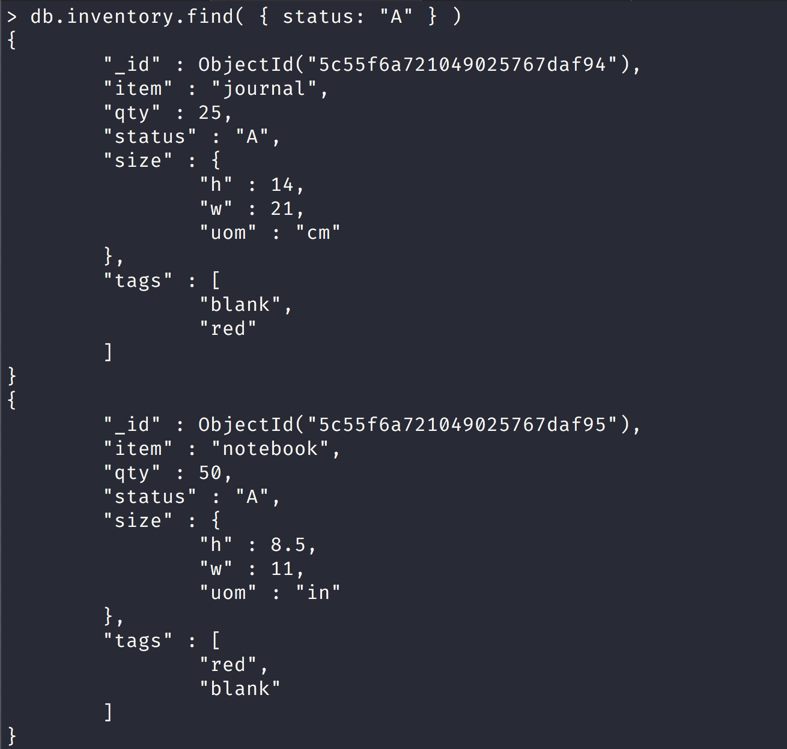

The operation corresponds to the following SQL statement:

```sql
SELECT * from inventory WHERE status = "A"
```

###### Return the Specified Fields and the _id Field Only

[Project Fields from Query Result](https://docs.mongodb.com/manual/tutorial/project-fields-from-query-results/#return-the-specified-fields-and-the-id-field-only)

* A projection can explicitly include several fields by setting the &#60;field&#62; to 1 in the projection document. 

* The following operation returns all documents that match the query. 

* In the result set, only the item, status and, by default, the _id fields return in the matching documents.

###### Suppress _id Field

You can remove the _id field from the results by setting it to 0 in the projection, as in the following example:

```js
db.inventory.find( { status: "A" }, { item: 1, status: 1, _id: 0 } )
```

> The operation corresponds to the following SQL statement:

```sql
SELECT item, status from inventory WHERE status = "A"
```

###### Return All But the Excluded Fields

[Return All But the Excluded Fields](https://docs.mongodb.com/manual/tutorial/project-fields-from-query-results/#return-all-but-the-excluded-fields)

> Instead of listing the fields to return in the matching document, you can use a projection to exclude specific fields. The following example which returns all fields except for the status and the instock fields in the matching documents:

```js
db.inventory.find( { status: "A" }, { status: 0, instock: 0 } )
```

**With the exception of the _id field, you cannot combine inclusion and exclusion statements in projection documents.**

###### Return Specific Fields in Embedded Documents

You can return specific fields in an embedded document. 

Use the dot notation to refer to the embedded field and set to 1 in the projection document.

In the screenshot below we return the fields: _id, qty, status, and "size.h":


###### Suppress Specific Fields in Embedded Documents

You can suppress specific fields in an embedded document. 

Use the dot notation to refer to the embedded field in the projection document and set to 0.

In the screenshot below we return neither the _id field nor the "size.h" fields:


###### Projection on Embedded Documents in an Array

> Use dot notation to project specific fields inside documents embedded in an array.

In the screenshot below we return only the "instock.warehouse" nested document:

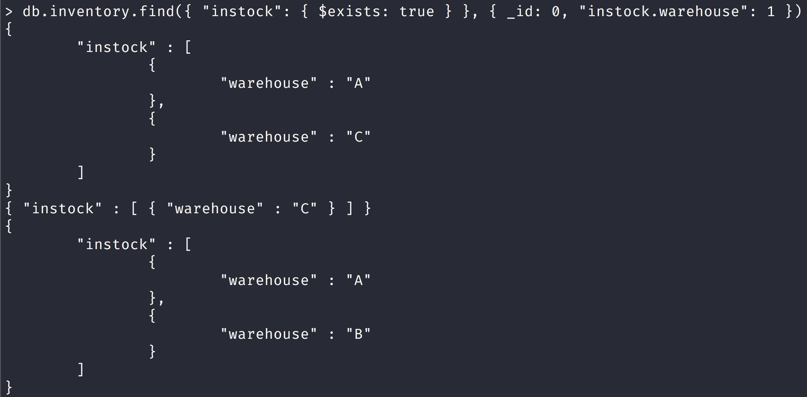

###### Project Specific Array Elements in the Returned Array

> For fields that contain arrays, MongoDB provides the following projection operators for manipulating arrays: $elemMatch, $slice, and $.

> The following example uses the $slice projection operator to return the last element in the instock array but also checks that the instock array exists:

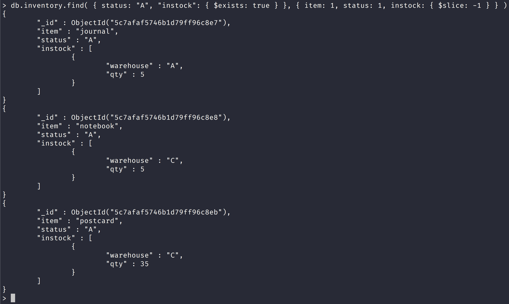

###### Query for Null or Missing Fields

###### Equality Filter

The { item : null } query matches documents that either contain the item field whose value is null or that do not contain the item field.


###### Type Check

> The { item : { $type: 10 } } query matches only documents that contain the item field whose value is null; i.e. the value of the item field is of BSON Type Null (type number 10) :


*The query returns only the document where the item field has a value of null.*

###### Existence Check

> The { item : { $exists: false } } query matches documents that do not contain the item field:


###### Iterate a Cursor in the mongo Shell

> The `db.collection.find()` method returns a cursor. To access the documents, you need to iterate the cursor. However, in the mongo shell, if the returned cursor is not assigned to a variable using the var keyword, then the cursor is automatically iterated up to 20 times to print up to the first 20 documents in the results.

###### Manually Iterate the Cursor

In the mongo shell, when you assign the cursor returned from the find() method to a variable using the var keyword, the cursor does not automatically iterate.


You can also use the cursor method next() to access the documents, as in the following example:

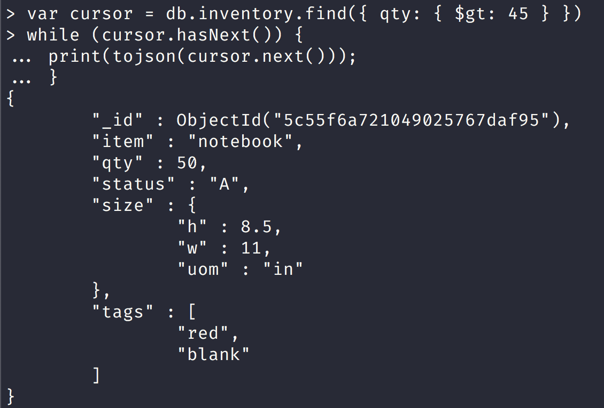

###### Update Documents

| Update Method | Description | Version Available |
| --- | --- | --- |
| `db.collection.updateOne()` | Updates at most a single document that match a specified filter even though multiple documents may match the specified filter. | New in version 3.2. | 
| `db.collection.updateMany()` | Update all documents that match a specified filter. | New in version 3.2. | 
| `db.collection.replaceOne()` | Replaces at most a single document that match a specified filter even though multiple documents may match the specified filter. | New in version 3.2. | 
| `db.collection.update()` | Either updates or replaces a single document that match a specified filter or updates all documents that match a specified filter. By default, the db.collection.update() method updates a single document. To update multiple documents, use the multi option. | Existing |

Let us add a series of documents to the inventory collection:

```js
db.inventory.insertMany( [
   { item: "canvas", qty: 100, size: { h: 28, w: 35.5, uom: "cm" }, status: "A" },
   { item: "journal", qty: 25, size: { h: 14, w: 21, uom: "cm" }, status: "A" },
   { item: "mat", qty: 85, size: { h: 27.9, w: 35.5, uom: "cm" }, status: "A" },
   { item: "mousepad", qty: 25, size: { h: 19, w: 22.85, uom: "cm" }, status: "P" },
   { item: "notebook", qty: 50, size: { h: 8.5, w: 11, uom: "in" }, status: "P" },
   { item: "paper", qty: 100, size: { h: 8.5, w: 11, uom: "in" }, status: "D" },
   { item: "planner", qty: 75, size: { h: 22.85, w: 30, uom: "cm" }, status: "D" },
   { item: "postcard", qty: 45, size: { h: 10, w: 15.25, uom: "cm" }, status: "A" },
   { item: "sketchbook", qty: 80, size: { h: 14, w: 21, uom: "cm" }, status: "A" },
   { item: "sketch pad", qty: 95, size: { h: 22.85, w: 30.5, uom: "cm" }, status: "A" }
] );
```

###### Update a Single Document

[Update a single document](https://docs.mongodb.com/manual/tutorial/update-documents/#update-a-single-document)

The following example uses the db.collection.updateOne() method on the inventory collection to update the first document where item equals "paper":


The update operation:

* uses the $set operator to update the value of the size.uom field to "cm" and the value of the status field to "P"

* uses the $currentDate operator to update the value of the lastModified field to the current date. 
	
	* If lastModified field does not exist, $currentDate will create the field. See $currentDate for details.

###### Update Multiple Documents

The following example uses the db.collection.updateMany() method on the inventory collection to update all documents where qty is less than 50:

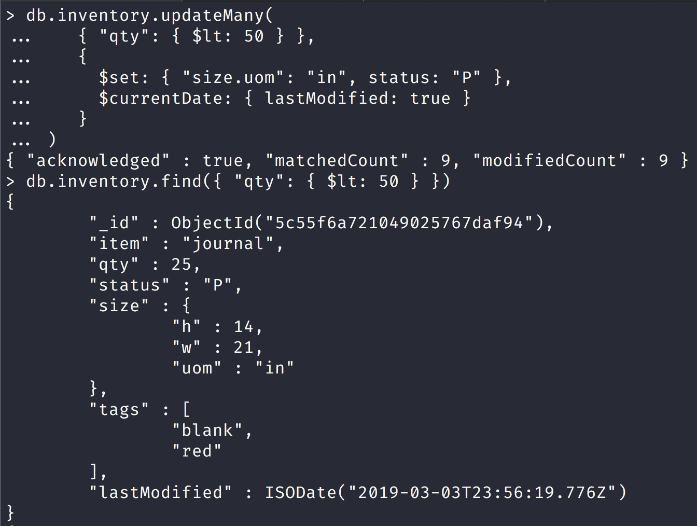

The update operation:

* uses the $set operator to update the value of the size.uom field to "in" and the value of the status field to "P"

* uses the $currentDate operator to update the value of the lastModified field to the current date. 

	* If lastModified field does not exist, $currentDate will create the field. See $currentDate for details.

###### Replace a Document

To replace the entire content of a document except for the _id field, pass an entirely new document as the second argument to db.collection.replaceOne().

When replacing a document, the replacement document must consist of only field/value pairs; i.e. do not include update operators expressions.

The replacement document can have different fields from the original document. In the replacement document, you can omit the _id field since the _id field is immutable; however, if you do include the _id field, it must have the same value as the current value.

The following example replaces the first document from the inventory collection where item: "paper":


###### Write behavior in mongodb

*All write operations in MongoDB are atomic on the level of a single document.*

###### _id Field

Once set, you cannot update the value of the _id field nor can you replace an existing document with a replacement document that has a different _id field value.

###### Delete Documents

Let us insert many documents that will be deleted in inventory collection:

```js
db.inventory.insertMany( [
   { item: "journal", qty: 25, size: { h: 14, w: 21, uom: "cm" }, status: "A" },
   { item: "notebook", qty: 50, size: { h: 8.5, w: 11, uom: "in" }, status: "P" },
   { item: "paper", qty: 100, size: { h: 8.5, w: 11, uom: "in" }, status: "D" },
   { item: "planner", qty: 75, size: { h: 22.85, w: 30, uom: "cm" }, status: "D" },
   { item: "postcard", qty: 45, size: { h: 10, w: 15.25, uom: "cm" }, status: "A" },
] );
```

###### Delete All Documents

[Remove Documents](https://docs.mongodb.com/manual/tutorial/remove-documents/)

| Delete Method | Description | Version Available |
| --- | --- | --- |
| `db.collection.deleteOne()` | Delete at most a single document that match a specified filter even though multiple documents may match the specified filter. | New in version 3.2. | 
| `db.collection.deleteMany()` | Delete all documents that match a specified filter. | New in version 3.2. | 
| `db.collection.remove()` | Delete a single document or all documents that match a specified filter. | Available in Early versions of mongodb. |

To delete all documents from a collection, pass an empty filter document {} to the db.collection.deleteMany() method.

The following example deletes all documents from the inventory collection:


The method returns a document with the status of the operation. For more information and examples, see deleteMany().

Let us reinsert inventory documents:

```js
db.inventory.insertMany( [
   { item: "journal", qty: 25, size: { h: 14, w: 21, uom: "cm" }, status: "A" },
   { item: "notebook", qty: 50, size: { h: 8.5, w: 11, uom: "in" }, status: "P" },
   { item: "paper", qty: 100, size: { h: 8.5, w: 11, uom: "in" }, status: "D" },
   { item: "planner", qty: 75, size: { h: 22.85, w: 30, uom: "cm" }, status: "D" },
   { item: "postcard", qty: 45, size: { h: 10, w: 15.25, uom: "cm" }, status: "A" },
] );
```

###### Delete All Documents that Match a Condition

You can specify criteria, or filters, that identify the documents to delete. 

The filters use the same syntax as read operations.

To specify equality conditions, use &#60;field&#62;:&#60;value&#62; expressions in the query filter document:

`{ <field1>: <value1>, ... }`

A query filter document can use the query operators to specify conditions in the following form:

`{ <field1>: { <operator1>: <value1> }, ... }`

*To delete all documents that match a deletion criteria, pass a filter parameter to the deleteMany() method.*

The following example removes all documents from the inventory collection where the status field equals "A":


The method returns a document with the status of the operation.

###### Delete Only One Document that Matches a Condition

To delete at most a single document that matches a specified filter (even though multiple documents may match the specified filter) use the db.collection.deleteOne() method.

The following example deletes the first document where status is "D":

```js
db.inventory.deleteOne( { status: "D" } )
```

###### Delete Behavior

[Delete Behavior](https://docs.mongodb.com/manual/tutorial/remove-documents/#delete-behavior)

*Delete operations do not drop indexes, even if deleting all documents from a collection.*

> All write operations in MongoDB are atomic on the level of a single document. For more information on MongoDB and atomicity, see Atomicity and Transactions.

#### Bread Crumb Navigation
_________________________

Previous | Next
:------- | ---:
← [Mongo Shell](./mongo-shell.md) | [Mongo CRUD Operations Part II](./mongo-crud-operations-part2.md) →
